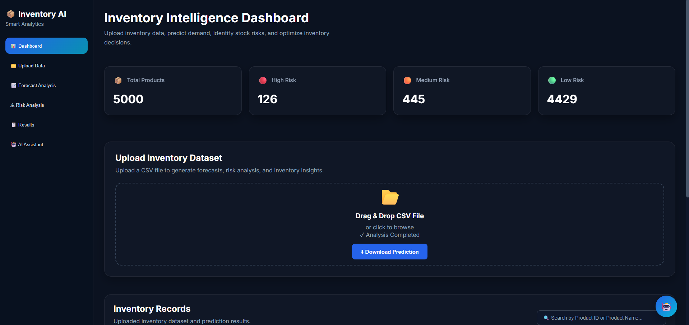
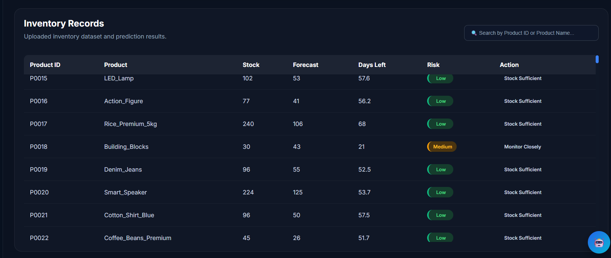
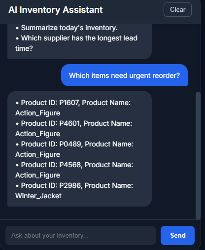

# 📦 Inventory Intelligence Dashboard with AI Assistant

An end-to-end Inventory Management and Demand Forecasting system that combines **Machine Learning**, **FastAPI**, **React**, and a **RAG-powered AI Chatbot** to help businesses monitor inventory, predict product demand, identify stock risks, and interact with inventory data using natural language.

---

# 📌 Project Overview

Managing inventory efficiently is one of the biggest challenges in retail and supply chain management. Overstocking increases storage costs, while understocking leads to lost sales and poor customer satisfaction.

This project provides an intelligent inventory analysis system that enables users to:

- Upload inventory datasets
- Predict future product demand using Machine Learning
- Analyze stock risk levels
- Generate inventory recommendations
- Download prediction reports
- Ask questions about inventory through an AI-powered RAG chatbot

---

# 🎯 Objectives

The primary objectives of this project are:

- Predict future product demand
- Identify High, Medium, and Low inventory risks
- Recommend inventory actions based on stock levels
- Visualize inventory statistics through an interactive dashboard
- Allow users to query inventory using natural language
- Demonstrate an end-to-end AI application using modern technologies

---

# 🛠 Tech Stack

## Machine Learning

- Python
- Pandas
- NumPy
- Scikit-Learn
- XGBoost
- Joblib

## Backend

- FastAPI
- Uvicorn
- FAISS
- Sentence Transformers
- Groq API
- Python-dotenv

## Frontend

- React
- Vite
- Axios
- CSS

---

# 📂 Project Workflow

```text
Upload CSV
      │
      ▼
FastAPI Backend
      │
      ▼
Demand Prediction
      │
      ▼
Inventory Risk Analysis
      │
      ▼
Save Prediction Results
      │
      ▼
Build FAISS Vector Store
      │
      ▼
React Dashboard
      │
      ▼
RAG AI Chatbot
```

---

# ⚙ Features

## 📁 CSV Upload

- Upload inventory dataset
- Automatic validation
- Stores latest uploaded dataset

---

## 🤖 Demand Prediction

The trained Machine Learning model predicts future product demand for every inventory item.

Prediction model:

- XGBoost Regressor

---

## 📊 Inventory Analysis

Each product is analyzed to calculate:

- Predicted Sales
- Daily Sales
- Days Left
- Risk Level
- Recommended Order Quantity
- Inventory Action

Risk categories include:

- 🔴 High Risk
- 🟠 Medium Risk
- 🟢 Low Risk

---

## 📈 Dashboard

Interactive dashboard displaying:

- Total Products
- High Risk Products
- Medium Risk Products
- Low Risk Products

Also includes:

- Inventory records table
- Color-coded risk badges
- Download prediction report

---

## 💬 AI Inventory Assistant

The project includes a Retrieval-Augmented Generation (RAG) chatbot.

Users can ask questions such as:

- Which products are high risk?
- Show products that need urgent reorder.
- Summarize today's inventory.
- Which supplier has the longest lead time?

The chatbot retrieves relevant inventory records using FAISS before generating responses with the Large Language Model.

---

---
# 📸 Project Screenshots

## Dashboard



---

## Inventory Analysis



---

## AI Inventory Assistant



# ✅ Conclusion

This project demonstrates a complete AI-powered inventory management workflow by combining Machine Learning, Inventory Risk Analysis, Modern Web Development, and Retrieval-Augmented Generation (RAG).

It provides an intuitive dashboard for inventory monitoring while enabling users to interact with inventory data through an AI assistant, making inventory analysis faster, more efficient, and more accessible.

